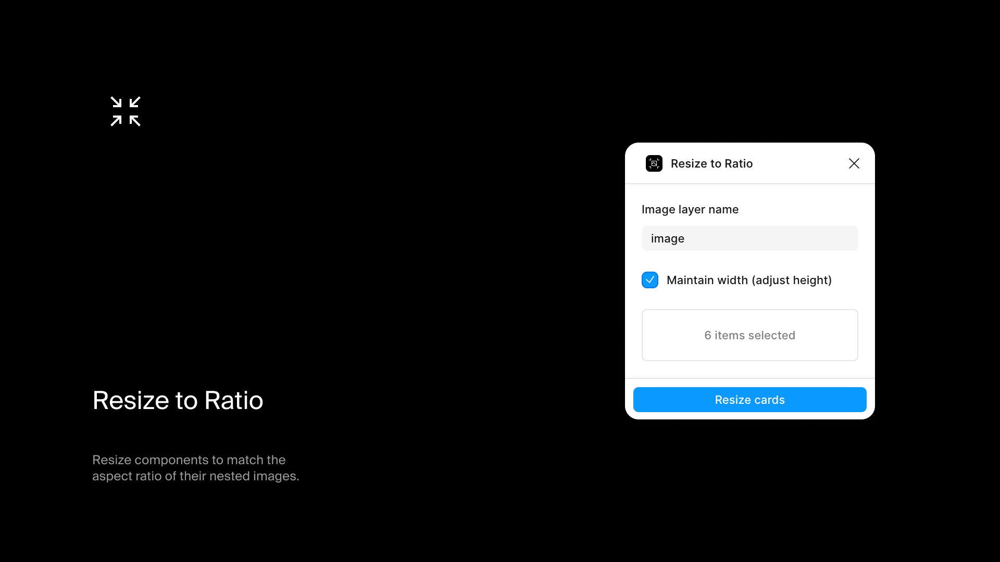

# Resize to Ratio

Resize components to the aspect ratio of the image inside them.

## Install

Get it from the [Figma Community](https://www.figma.com/community/plugin/1488572643184012930/resize-to-ratio)

## What it does

Adjusts the dimensions of selected components based on the natural aspect ratio of an image layer inside them. Useful for card components where you want the container to fit the image properly.

## Usage

1. Select one or more component instances containing an image layer
2. Run the plugin
3. Specify the image layer name (default: `image`)
4. Choose to maintain width or height
5. Click resize

## Options

- **Image layer name** - Name of the nested layer containing the image fill
- **Maintain width** - Keep width fixed, adjust height to match ratio
- **Maintain height** - Keep height fixed, adjust width to match ratio

## Requirements

- The image layer must use "Fill" for both width and height constraints.

## Development

```bash
npm install
npm run dev    # Watch mode
npm run build  # Production build
```
