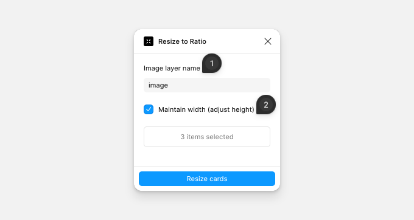

# Resize to Ratio

Resize to Ratio fits each card you select to its image. A card with a landscape photo in a square image area, for example, gets shorter until the image area matches the photo.

## Resize cards

Select one or more cards, then run the plugin. A card can be a component, an instance, or a frame.

1. **Image layer name** — the layer in each card with the image fill. Case doesn't matter.
2. **Maintain width (adjust height)** — clear it to keep the height and change the width instead.

Click **Resize cards** to resize every selected card. Press Ctrl/Cmd+Z to undo.

The plugin resizes the card, not the image layer. If the image doesn't change size with the card, set the image layer to **Fill container**, or to **Left and right** and **Top and bottom** constraints.

If no cards were resized, check the layer name and that the layer has an image fill; the plugin uses the first layer with that name in each card. If a card is skipped because its image isn't loaded, wait for the image to appear, then run the plugin again.
